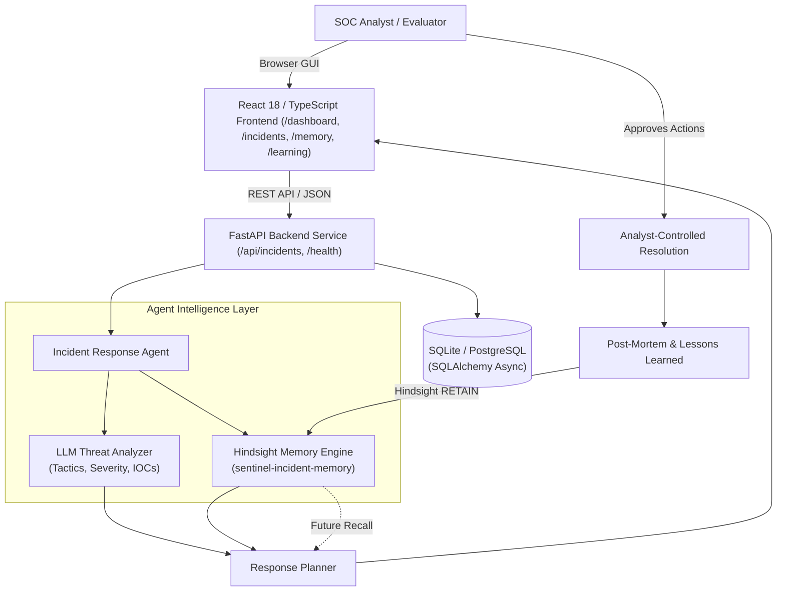

# Sentinel Memory

> A Hindsight-powered Cybersecurity Incident Response Agent for SOC analysts that remembers past investigations, root causes, and containment outcomes to continuously improve future recommendations.

[](https://opensource.org/licenses/MIT)
[](https://www.python.org/downloads/)
[](https://fastapi.tiangolo.com/)
[](https://react.dev/)
[](https://github.com/vectorize-io/hindsight)
[-emerald.svg)]()

---

## Problem

Modern Security Operations Center (SOC) teams face an acute operational challenge: **organizational amnesia**. 

When an alert triggers, analysts often investigate it in isolation. Post-mortems are filed away into static wikis, and months later, when a similar attack strikes a different server or asset, a different analyst repeats the exact same manual investigation steps.

Standard AI chatbots and conventional Retrieval-Augmented Generation (RAG) systems fail to solve this because they only perform stateless vector search against static textbooks or policy manuals. They do not know what actions your team took during the last incident, whether those actions caused collateral service disruption, or what true underlying root cause was discovered during the post-mortem.

---

## Solution

**Sentinel Memory** equips the SOC analyst with an intelligent incident response agent powered by **Hindsight** (`vectorize-io/hindsight`), a persistent, biomimetic memory engine:

1. **SOC Analyst**: Operates with human-in-the-loop oversight, retaining full command over all response actions.
2. **Incident Telemetry**: Ingests attack telemetry, indicators of compromise (IOCs), and log observables across servers and DMZ bastions.
3. **AI Threat Analysis**: Classifies threat tactics against the MITRE ATT&CK framework and assesses attack severity.
4. **Hindsight Memory**: Retains structured, outcome-oriented **Experience Capsules** linking attack patterns directly to discovered root causes and proven containment steps.
5. **Memory-Informed Recommendation**: Synthesizes past experiences to inject high-priority **Critical Audits** and **Prevention Runbooks** into active recommendations.
6. **Analyst Resolution**: The analyst reviews, approves, and executes response directives.
7. **Continuous Learning**: Once resolved, post-mortem findings are retained into Hindsight memory, immediately informing all future incident triage.

---

## Core Workflow

```
Detect ──> Analyze ──> Recall (Hindsight) ──> Recommend ──> Resolve ──> Retain (Hindsight) ──> Improve
```

1. **Detect**: Alert ingested into the SOC queue with telemetry and initial evidence.
2. **Analyze**: AI threat analysis classifies tactics (e.g., MITRE ATT&CK T1110.001) and extracts IOCs.
3. **Recall**: Hindsight queries the memory bank (`sentinel-incident-memory`) for relevant past experiences.
4. **Recommend**: Agent generates adaptive response directives enriched with historical root causes and lessons.
5. **Resolve**: Analyst approves and executes containment and remediation actions.
6. **Retain**: Post-mortem findings and verified outcomes are committed to persistent memory.
7. **Improve**: Future alerts matching similar vectors automatically benefit from accumulated institutional knowledge.

---

## Why Hindsight?

| Stateless Incident Analysis (Standard RAG / Chatbots) | Experience-Informed Analysis (Sentinel Memory + Hindsight) |
| :--- | :--- |
| Pulls static documentation chunks based on text keywords. | Recalls structured **Experience Capsules** linking context, root cause, action, and verified outcome. |
| Recommends generic textbook steps (*"block attacker IP"*). | Recommends **organizationally proven actions** and alerts analysts to previous root causes. |
| Repeats previous diagnostic mistakes and ignores past post-mortems. | Injects **Critical Audits** (e.g., config drift) and **Prevention Runbooks** discovered in prior cases. |
| Static knowledge base requiring manual documentation updates. | **Continuously evolves** with every resolved incident and committed post-mortem. |

### The Experiential Data Flow
```
[ Historical Incident ] ──> [ Outcome / Post-Mortem ] ──> [ Hindsight Retention ]
                                                                    │
                                                                    ▼
[ Subsequent Incident ] <── [ Recommendation Context ] <── [ Hindsight Recall ]
```

When an alert occurs, Hindsight uses multi-strategy retrieval (temporal, entity, keyword, and semantic) across the agent's memory bank. If an identical or related attack was previously solved, the agent extracts the past root cause (e.g., configuration drift from an OS package update) and surfaces it directly in the new recommendation before a breach occurs.

*(Note: Sentinel Memory does not claim to guarantee flawless security outcomes; rather, it systematically equips the analyst with verified historical precedent and prevents recurring operational mistakes.)*

---

## Architecture



---

## Tech Stack

- **Frontend**: React 18, TypeScript, Vite 5, Tailwind CSS, Lucide Icons, React Router DOM v6
- **Backend API**: Python 3.10+, FastAPI, Uvicorn, Pydantic v2, SQLAlchemy 2.0 (Async), aiosqlite
- **Memory Engine**: Hindsight Persistent Memory SDK with unified Mock and Client adapters
- **AI / LLM Layer**: Groq / OpenAI provider integration with built-in deterministic local simulation
- **Testing & Verification**: Pytest, Pytest-Asyncio, TypeScript Compiler (`tsc`), Vite Production Builder

---

## Repository Structure

```
sentinel-memory/
│
├── frontend/                   # React 18 SOC analyst investigation dashboard
│   ├── src/
│   │   ├── components/         # Stepper, modals, memory cards, recommendation panels
│   │   ├── pages/              # Dashboard, Incidents, Detail, Memory, Learning
│   │   ├── services/           # api.ts (REST client with mock fallback)
│   │   └── types/              # Domain TypeScript contracts
│   ├── package.json
│   ├── vite.config.ts
│   └── .env.example
│
├── backend/                    # FastAPI backend & Sentinel Memory agent
│   ├── app/
│   │   ├── api/routes/         # health.py, incidents.py
│   │   ├── agents/             # Incident analyzer, response planner, orchestrator
│   │   ├── hindsight/          # Service, client adapter, mock adapter, schemas
│   │   ├── services/           # Incident, analysis, recommendation, learning services
│   │   ├── models/             # SQLAlchemy ORM IncidentModel
│   │   └── db/session.py       # Async database engine & sessionmaker
│   ├── tests/                  # Unit and integration pytest suite
│   ├── requirements.txt
│   └── .env.example
│
├── data/
│   ├── scenarios/              # Synthetic incident scenarios (INC-2026-001, INC-2026-002, INC-2026-003)
│   └── seed/seed_data.py
│
├── docs/                       # Technical & evaluation documentation
│   ├── ARCHITECTURE.md         # Subsystem architecture & component interactions
│   ├── API.md                  # REST contract specification
│   ├── HINDSIGHT.md            # Retain, recall, and cognitive memory lifecycle
│   ├── DEMO.md                 # 2-3 minute presentation script & troubleshooting
│   ├── DECISIONS.md            # Architecture Decision Records (ADRs)
│   └── TEAM_OWNERSHIP.md       # Workstream ownership matrix
│
├── scripts/
│   ├── seed_demo.py            # Deterministic demo database reset
│   ├── verify_final_demo.py    # Automated Golden Path end-to-end test
│   ├── verify_phase4_evaluation.py # Latency and recommendation provenance evaluation
│   ├── verify_phase3_loop.py   # Full backend integration verification
│   └── run_milestone1_demo.py  # Standalone CLI memory loop
│
├── package.json                # Root workspace scripts
├── pytest.ini                  # Pytest configuration
├── .env.example                # Root environment template
├── .gitignore
└── README.md
```

---

## Setup

### Prerequisites
- Python 3.10+ (tested on Python 3.10–3.14)
- Node.js 18+ (tested on Node v20 / v22 with npm)
- Git

### Installation Steps

1. **Clone the Repository**:
   ```bash
   git clone https://github.com/siddharthg-7/Incident-Response-Agent.git
   cd Incident-Response-Agent
   ```

2. **Configure Environment Variables**:
   ```bash
   cp .env.example .env
   cp frontend/.env.example frontend/.env
   ```

3. **Install Backend Dependencies**:
   ```bash
   pip install -r backend/requirements.txt
   ```

4. **Install Frontend Dependencies**:
   ```bash
   cd frontend
   npm install
   cd ..
   ```

5. **Seed Demo Scenarios**:
   ```bash
   python scripts/seed_demo.py
   ```

---

## Environment Variables

All variables are documented with safe defaults in `.env.example` templates. **No real secrets or private credentials are committed.**

### Key Backend Settings (`.env` or `backend/.env`)
| Variable | Default | Purpose |
| :--- | :--- | :--- |
| `API_HOST` | `0.0.0.0` | Host interface for FastAPI |
| `API_PORT` | `8000` | Port for REST API service |
| `CORS_ORIGINS` | `["http://localhost:5173","http://localhost:3000"]` | Allowed frontend origins |
| `DATABASE_URL` | `sqlite+aiosqlite:///./sentinel_memory.db` | Async SQLite database path |
| `HINDSIGHT_MODE` | `mock` | `mock` for deterministic local development; `client` for Hindsight Cloud / Docker |
| `HINDSIGHT_BANK_ID`| `sentinel-incident-memory` | Target memory bank identifier |
| `LLM_PROVIDER` | `mock` | `mock` (built-in rule/heuristic), `groq`, or `openai` |

### Key Frontend Settings (`frontend/.env`)
| Variable | Default | Purpose |
| :--- | :--- | :--- |
| `VITE_API_URL` | `http://localhost:8000` | Target FastAPI backend URL |
| `VITE_USE_MOCK_API` | `false` | `false` to connect to backend; `true` for standalone offline mode |

---

## Running Locally

### Terminal 1: Backend API
```bash
python -m uvicorn app.main:app --app-dir backend --host 127.0.0.1 --port 8000
```
- API Health Status: [http://127.0.0.1:8000/health](http://127.0.0.1:8000/health)
- Interactive OpenAPI Docs: [http://127.0.0.1:8000/docs](http://127.0.0.1:8000/docs)

### Terminal 2: Frontend Dashboard
```bash
cd frontend
npm run dev
```
- Application Web App: [http://localhost:5173](http://localhost:5173)

---

## Demo

The primary demonstration showcases how Sentinel Memory uses experience to transform incident response:

1. **Incident 1 (`INC-2026-001`)**:
   - High volume SSH brute force against perimeter bastion `bastion-01`.
   - Analyst investigates, blocks the attacker IP, and uncovers the true root cause in post-mortem: an automated package upgrade had enabled password authentication in `sshd_config`.
   - The analyst clicks **Post-Mortem & Retain**, committing the experience to Hindsight.

2. **Incident 2 (`INC-2026-002`)**:
   - A subsequent attack from a completely different IP hits internal server `app-prod-04`.
   - The analyst clicks **Recall & Recommend**.
   - Hindsight recalls `INC-2026-001` (84.8% similarity).
   - The agent automatically synthesizes a **CRITICAL AUDIT** directive warning the analyst to inspect `sshd_config` on `app-prod-04` immediately, along with an automated **PREVENTION RUNBOOK**.

For the complete, minute-by-minute judge presentation script and troubleshooting runbook, see:
**[docs/DEMO.md](docs/DEMO.md)**

To reset the database to this clean state at any time:
```bash
python scripts/seed_demo.py
```

---

## Testing

Run the complete verification and test suite:

```bash
# 1. Frontend TypeScript type safety check (0 errors):
npm --prefix frontend run typecheck

# 2. Frontend production bundle build:
npm --prefix frontend run build

# 3. Backend unit and integration test suite:
pytest backend/tests -v

# 4. Golden Path end-to-end memory loop verification:
python scripts/verify_final_demo.py

# 5. Reliability, latency, and recommendation provenance evaluation:
python scripts/verify_phase4_evaluation.py
```

---

## Hindsight Integration

For technical details on memory capsule schemas, the TEMPR multi-strategy recall engine, and adapter architecture:
**[docs/HINDSIGHT.md](docs/HINDSIGHT.md)**

---

## Documentation

- **System Architecture**: [docs/ARCHITECTURE.md](docs/ARCHITECTURE.md)
- **REST API Specification**: [docs/API.md](docs/API.md)
- **Hindsight Memory Details**: [docs/HINDSIGHT.md](docs/HINDSIGHT.md)
- **Presentation Walkthrough & Troubleshooting**: [docs/DEMO.md](docs/DEMO.md)
- **Architecture Decision Records (ADRs)**: [docs/DECISIONS.md](docs/DECISIONS.md)
- **Team Ownership Matrix**: [docs/TEAM_OWNERSHIP.md](docs/TEAM_OWNERSHIP.md)
- **Developer Quickstart**: [docs/DEVELOPMENT.md](docs/DEVELOPMENT.md)

---

## Project Status

Sentinel Memory is in **FINAL SHIP (Feature Freeze)** state for hackathon submission. All core architectural commitments, Hindsight memory adapters, backend services, SOC investigation UI, and automated evaluation harnesses are verified, reproducible, and ready for judge inspection.
