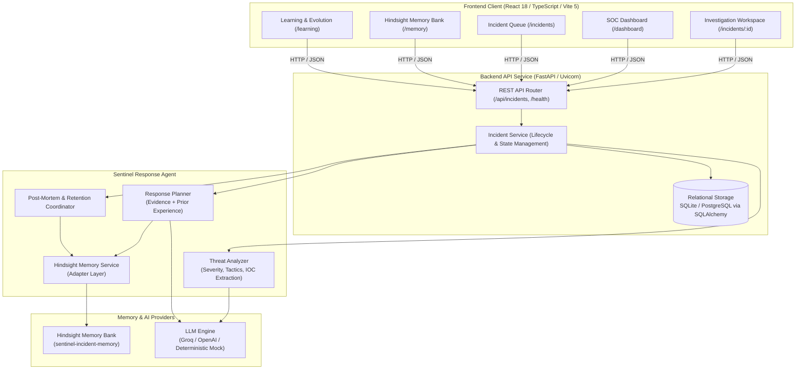

# Sentinel Memory - System Architecture

## 1. High-Level Vision

**Sentinel Memory** is a Hindsight-powered Cybersecurity Incident Response Agent designed for Security Operations Center (SOC) analysts.

Unlike conventional chatbot or single-pass RAG systems that query static documentation or treat each alert in isolation, Sentinel Memory implements an **experience-driven learning loop**:

```
Detect → Analyze → Recall (Hindsight) → Recommend → Resolve (Analyst) → Retain (Hindsight) → Improve
```

When an alert triggers, the agent recalls past incident investigations, root causes discovered, remediation actions taken, and post-mortem lessons learned. As the SOC team resolves incidents and documents post-mortems, Hindsight retains those experiences in an outcome-oriented memory bank (`sentinel-incident-memory`), making future response recommendations progressively sharper, faster, and context-aware.

---

## 2. End-to-End Component Flow



---

## 3. Core Architectural Subsystems

### 1. Frontend Client
- **Stack**: React 18, Vite 5, TypeScript, Tailwind CSS, Lucide Icons.
- **Role**: Provides the SOC analyst with a mission-critical, dark-themed operations center:
  - **Investigation Pipeline Stepper**: Visualizes the 6-stage cognitive journey from alert ingestion to persistent learning.
  - **Memory Comparison View**: Juxtaposes past incident root causes, actions, and outcomes directly beside current telemetry.
  - **Interactive Action Approval**: Empowers analysts to approve, modify, or reject AI-generated response directives.

### 2. Backend API Service
- **Stack**: FastAPI, Uvicorn, Pydantic v2, SQLAlchemy 2.0 (async).
- **Role**: Exposes REST endpoints for incident lifecycle state transitions (`NEW`, `ANALYZED`, `RECOMMENDATION_READY`, `RESOLVED`, `POSTMORTEM_COMPLETE`), orchestrates background threat analysis, queries Hindsight memory, and enforces strict schema validation.

### 3. Incident Agent Orchestrator
- **Role**: Coordinates the response pipeline between threat analysis, memory recall, and recommendation generation. Ensures analysts receive transparent reasoning and explicit provenance traces for every proposed action.

### 4. LLM Threat Analysis
- **Role**: Ingests raw syslog, auth log samples, indicators of compromise (IOCs), and target asset metadata to classify the attack vector, identify MITRE ATT&CK techniques (e.g., T1110.001 Password Guessing, T1021.004 SSH), and compute an objective severity score.

### 5. Hindsight Experiential Memory
- **Role**: Acts as the long-term memory bank for the agent (`sentinel-incident-memory`). Indexes structured experience capsules that link attack patterns to proven outcomes and verified root causes.

### 6. Recommendation Generation (Response Planner)
- **Role**: Synthesizes current incident observables with recalled historical precedents. Injects memory-derived directives into the plan:
  - **Standard Actions**: Perimeter containment (e.g., firewall drop rules).
  - **Critical Audits**: High-priority configuration inspections derived from prior root causes (e.g., checking `sshd_config` for package upgrade drift).
  - **Prevention Runbooks**: Long-term hardening derived from prior post-mortems (e.g., automated Ansible compliance checks).

### 7. Analyst-Controlled Response
- **Role**: Safeguards operational stability. The agent proposes structured, explainable actions with confidence metrics, but execution is strictly analyst-controlled (human-in-the-loop).

### 8. Post-Mortem Analysis
- **Role**: Records the true root cause uncovered after deep forensic triage (e.g., configuration drift, unpatched dependency, compromised credential) and actionable lessons learned to prevent recurrence.

### 9. Learning & Retention Coordinator
- **Role**: Constructs an outcome-oriented experience capsule and invokes Hindsight `retain()`, updating the organizational memory bank so all future alerts immediately benefit from the newly resolved case.

---

## 4. The Two-Incident Learning Loop

The fundamental technical thesis of Sentinel Memory is proven across two sequential incidents:

1. **Incident 1 Ingestion (`INC-2026-001`)**:
   - Attack: High volume SSH brute force against perimeter bastion `bastion-01` (14,200 failed attempts).
   - Analysis: Classified as MITRE ATT&CK T1110.001 credential attack.
   - Resolution: Analyst applies edge firewall drop rule.
   - Post-Mortem: Investigation reveals that a routine OS package update had overwritten `sshd_config`, re-enabling password authentication. Lesson documented: enforce automated Ansible compliance checks fleet-wide.
   - **Hindsight RETAIN**: The complete outcome capsule is retained into memory bank `sentinel-incident-memory`.

2. **Incident 2 Ingestion (`INC-2026-002`)**:
   - Attack: Similar SSH brute force hits production host `app-prod-04` from a completely different IP address (`203.0.113.88`).
   - **Hindsight RECALL**: The agent queries the memory bank and recalls `INC-2026-001` with an 84.8% semantic similarity match.
   - **Memory-Informed Recommendation**: The agent not only suggests dropping the attacker IP, but automatically generates a `CRITICAL AUDIT` warning about configuration drift on `app-prod-04` and injects the `PREVENTION RUNBOOK` derived from `INC-2026-001`.

---

## 5. Architectural Safeguards

1. **Human-in-the-Loop Safety**: In accordance with enterprise cybersecurity standards, the agent produces structured, explainable recommendations with confidence scores and rationale. Automated destructive actions (e.g., host isolation, firewall drops) require explicit analyst approval.
2. **Adapter Pattern for Memory**: `HindsightService` wraps a `BaseHindsightAdapter` interface. The application toggles seamlessly between `MockHindsightAdapter` (deterministic local development and 100% offline test reliability) and `HindsightClientAdapter` (Hindsight Cloud or self-hosted Docker daemon).
3. **Provider-Agnostic LLM Layer**: The agent analyzer and recommender are decoupled from any specific model vendor, supporting Groq, OpenAI, or deterministic local simulation.
4. **Resilient Dual-Mode Frontend**: The React frontend connects natively to the FastAPI backend with real-time health polling and auto-reconnection, with an optional standalone mock fallback for offline evaluation.
