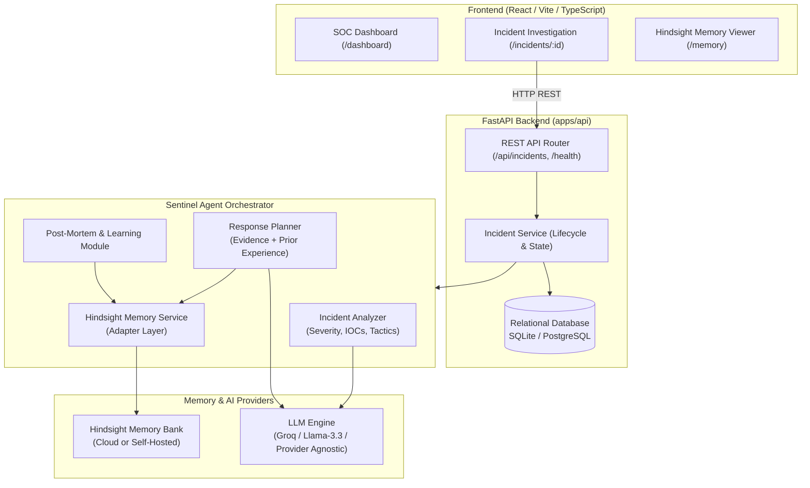

# Sentinel Memory - System Architecture

## 1. High-Level Vision

**Sentinel Memory** is a Hindsight-powered Cybersecurity Incident Response Agent designed for Security Operations Center (SOC) analysts.

Unlike conventional chatbot or single-pass RAG systems that query static documentation, Sentinel Memory implements an **experience-driven learning loop**:

```
Detect → Analyze → Recall (Hindsight) → Recommend → Resolve (Analyst) → Retain (Hindsight) → Improve
```

When an alert triggers, the agent recalls past incident investigations, actual root causes discovered, remediation actions taken, and post-mortem lessons learned. As the SOC team resolves incidents, Hindsight retains those experiences, making future response recommendations progressively sharper, faster, and context-aware.

---

## 2. End-to-End Component Flow



---

## 3. The Central Memory Loop (Milestone 1)

The technical heart of Sentinel Memory is the adaptive loop:

1. **Incident 1 Ingestion**: Incoming security alert (e.g., SSH Brute Force from an external IP targeting a bastion host).
2. **Analysis**: Agent parses syslog/auth logs, identifies failed root logins, categorizes attack (MITRE T1110.001).
3. **Response & Resolution**: Analyst blocks IP, disables password authentication, and issues SSH keys.
4. **Post-Mortem**: Document root cause (password auth left enabled on public port 22) and lesson learned (enforce key-only SSH + automated fail2ban).
5. **Hindsight RETAIN**: The complete outcome-oriented experience is saved to Hindsight's memory bank.
6. **Incident 2 Ingestion**: A new brute force alert occurs on a different server/IP.
7. **Hindsight RECALL**: The agent retrieves the prior SSH incident experience.
8. **Context-Aware Recommendation**: The agent not only suggests blocking the new IP, but explicitly warns about the root cause discovered last time (password auth vulnerability) and references the previous successful remediation!

---

## 4. Key Architectural Safeguards

1. **Recommendation-First, No Autonomous Destruction**: In accordance with enterprise cybersecurity best practices, the agent produces structured, explainable recommendations with confidence scores and rationale. Automated remediation requires explicit SOC analyst confirmation.
2. **Adapter Pattern for Memory**: `HindsightService` wraps a `BaseHindsightAdapter`. The application can seamlessly toggle between `MockHindsightAdapter` (in-memory for unit testing and local development) and `HindsightClientAdapter` (Hindsight Cloud or Docker daemon).
3. **Provider-Agnostic LLM Layer**: The agent analyzer and recommender are decoupled from any specific model vendor, supporting Groq, OpenAI, or local models.
